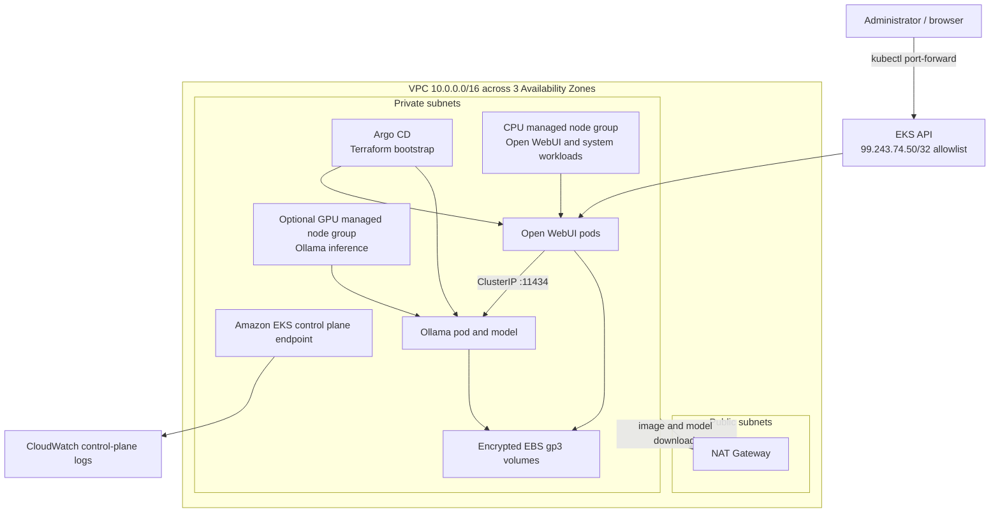

# AWS Architecture Specification

## 1. Purpose and scope

Build an AWS EKS platform that runs a self-hosted large language model through
Ollama and exposes it through Open WebUI. Terraform manages AWS infrastructure;
Helm manages Kubernetes applications and add-ons.

This specification targets a cost-conscious `dev` environment in `us-east-1`.
Open WebUI is accessed through `kubectl port-forward`; no public application
endpoint is created.

### Requirement traceability

| Requirement                          | Design decision                                                                                                                                              |
| ------------------------------------ | ------------------------------------------------------------------------------------------------------------------------------------------------------------ |
| Create EKS for a self-hosted LLM     | A private-node, multi-AZ EKS cluster with managed node groups                                                                                                |
| Deploy the model through Ollama      | Ollama Helm release, internal ClusterIP service, persistent model volume, optional GPU scheduling                                                            |
| Deploy Open WebUI                    | Open WebUI Helm release connected only to the internal Ollama service                                                                                        |
| Manage infrastructure with Terraform | Terraform manages AWS, EKS, and the Argo CD bootstrap Helm release; Argo CD manages the application releases                                                 |
| Use latest Helm chart versions       | Resolve the newest compatible chart version during planned upgrades, test it, and pin it in source; do not use an unpinned version in repeatable deployments |

## 2. Architecture decisions

### 2.1 Logical architecture



Open WebUI and Argo CD use ClusterIP services. Operators access them through
authenticated EKS access and `kubectl port-forward`. No ALB, public application
IP address, Route 53 record, or ACM certificate is created for dev.

### 2.2 Availability zones and subnets

Use the first three available Availability Zones in the selected region, unless
an explicit AZ list is supplied.

| Subnet type | CIDRs                                             | Purpose                   |
| ----------- | ------------------------------------------------- | ------------------------- |
| Public      | `10.0.0.0/20`, `10.0.16.0/20`, `10.0.32.0/20`     | NAT Gateway               |
| Private     | `10.0.128.0/19`, `10.0.160.0/19`, `10.0.192.0/19` | EKS worker nodes and pods |

Required subnet tags:

- All subnets: `kubernetes.io/cluster/<cluster-name> = shared`
- Public: `kubernetes.io/role/elb = 1`
- Private: `kubernetes.io/role/internal-elb = 1`

Worker nodes have no public IP addresses. Public subnets route through an
Internet Gateway. Private subnets route outbound traffic through NAT for ECR,
container registry, Helm repository, OS package, and Ollama model downloads.

For `dev`, deploy one NAT Gateway to reduce cost and accept that it is a
single-AZ egress dependency. For `prod`, deploy one NAT Gateway per AZ and route
each private subnet to the NAT Gateway in the same AZ.

### 2.3 EKS cluster

- Use Amazon EKS managed control plane and EKS managed node groups.
- Kubernetes version: `1.35`, subject to availability in `us-east-1`.
- Managed node groups use EKS-optimized Amazon Linux 2023 AMIs and cgroup v2.
- Enable private endpoint access.
- Enable public endpoint access for initial administration, restricted by
  `eks_endpoint_public_access_cidrs = ["99.243.74.50/32"]`; production should use private access
  through VPN, Direct Connect, or an approved management network.
- Use EKS access entries for administrator access; do not manage users through
  the legacy `aws-auth` ConfigMap.
- Enable API server envelope encryption with a customer-managed KMS key.
- Enable API, audit, authenticator, controller manager, and scheduler control
  plane logs in CloudWatch with 30-day retention for dev.
- Enable control-plane and node security groups with only required ingress.

Required managed EKS add-ons:

- Amazon VPC CNI
- CoreDNS
- kube-proxy
- EBS CSI driver using EKS Pod Identity (IRSA is acceptable if Pod Identity is
  unavailable)
- EKS Pod Identity Agent when Pod Identity is used

Add-on versions must be compatible with the configured EKS version. Terraform
should request the newest AWS-recommended compatible version during a planned
upgrade and then record/pin the selected version.

### 2.4 Node groups and scheduling

#### Bootstrap/CPU node group

Runs CoreDNS, controllers, Open WebUI, and other general workloads.

| Setting                     | Value                 |
| --------------------------- | --------------------- |
| Instance type               | `t3.large`            |
| Capacity type               | On-Demand             |
| Minimum / desired / maximum | `1 / 1 / 3`           |
| Root volume                 | Encrypted gp3, 50 GiB |
| AMI family                  | EKS-optimized AL2023  |
| Labels                      | `workload=general`    |

#### Optional GPU inference node group

Required when the selected model cannot meet performance requirements on CPU.
It is disabled by default so the stack can be deployed cheaply and validated
without GPU quota.

| Setting                     | Value                                                                   |
| --------------------------- | ----------------------------------------------------------------------- |
| Default instance type       | `g5.xlarge`                                                             |
| Capacity type               | On-Demand; Spot may be explicitly selected for disposable dev inference |
| Minimum / desired / maximum | `0 / 0 / 2`; GPU capacity is disabled initially                         |
| Root volume                 | Encrypted gp3, 100 GiB                                                  |
| AMI family                  | EKS-optimized AL2023 NVIDIA                                             |
| Labels                      | `workload=ollama`, `accelerator=nvidia`                                 |
| Taint                       | `nvidia.com/gpu=true:NoSchedule`                                        |

When enabled, install the NVIDIA device plugin by Helm. The Ollama pod must have
the matching toleration, node selector, and a `nvidia.com/gpu: 1` resource
limit. GPU instance availability and service quota must be checked in the target
region before deployment.

When GPU is disabled, schedule Ollama on the general node group without a GPU
resource request. This mode is appropriate only for small models or functional
testing.

### 2.5 Storage

Create an encrypted `gp3` StorageClass backed by the EBS CSI driver with
`volumeBindingMode: WaitForFirstConsumer`, expansion enabled, and the KMS key
used for EBS encryption.

| Workload   | Default PVC | Mount purpose                        | Access mode   |
| ---------- | ----------- | ------------------------------------ | ------------- |
| Ollama     | 100 GiB     | `/root/.ollama` model cache          | ReadWriteOnce |
| Open WebUI | 10 GiB      | `/app/backend/data` application data | ReadWriteOnce |

Ollama defaults to one replica because an EBS `ReadWriteOnce` model volume and a
single GPU cannot safely support multiple replicas. Scaling inference requires
a deliberate multi-replica design with one volume/model cache per replica or a
shared artifact-distribution strategy.

Set the EBS reclaim policy to `Delete` for this disposable dev environment so
application volumes are removed when their claims are deleted. Terraform and
Argo CD destruction procedures must explicitly delete the application PVCs
before cluster teardown. Production must use `Retain`, add AWS Backup schedules,
and test restoration.

### 2.6 Application deployment

Use a dedicated namespace named `llm`.

#### Argo CD ownership boundary

- Terraform installs and pins Argo CD through Helm after EKS and its core add-ons
  are ready.
- Argo CD owns the Ollama and Open WebUI application definitions and synchronizes
  them from manifests or Helm values committed to this repository.
- Terraform must not also manage those same application Helm releases.
- Argo CD uses a ClusterIP service and is accessed only with
  `kubectl port-forward` in dev.

#### Ollama

- Deploy with the upstream/community Ollama Helm chart selected by the project.
- Expose only a Kubernetes `ClusterIP` service on port `11434`; never create a
  public LoadBalancer or public ingress for the Ollama API.
- Persist `/root/.ollama` using the Ollama PVC.
- Configure CPU/memory requests and limits. With GPU enabled, request one GPU and
  use the GPU scheduling constraints described above.
- Specify `llama3.2:3b` in the Argo CD-managed Ollama Helm values and pull that
  model with an idempotent init/startup mechanism. Pin the full model tag rather
  than using an implicit latest model.
- Use readiness and liveness probes against the Ollama API.
- Use `RollingUpdate` only when the storage/scheduling combination supports it;
  otherwise use `Recreate` to avoid two pods contending for one RWO volume.

#### Open WebUI

- Deploy with the official Open WebUI Helm chart.
- Configure its Ollama base URL as `http://<ollama-service>.llm.svc.cluster.local:11434`.
- Persist `/app/backend/data` using the Open WebUI PVC.
- Start with one replica. Use two or more replicas only after externalizing or
  sharing session/application state as supported by the chosen Open WebUI
  release.
- Enable Open WebUI authentication and bootstrap the first administrator through
  a documented, non-public process.
- Store application credentials in Kubernetes Secrets. Do not commit rendered
  Secret manifests or plaintext values. Create them out-of-band with `kubectl`
  or use an encrypted GitOps format such as SOPS before automating them.
- Expose Open WebUI only through a ClusterIP service. Access it with
  `kubectl -n llm port-forward service/<open-webui-service> 8080:80`.

#### Helm chart version policy

"Latest" means the newest chart version compatible with the selected Kubernetes
and application versions at the time of a planned deployment. The workflow is:

1. Query the chart repository for its newest compatible version.
2. Review release notes and render/test the chart in dev.
3. Pin the exact chart version in Terraform so deployments are repeatable.
4. Upgrade deliberately through a dependency automation PR or a scheduled
   maintenance change; never rely on an omitted version to change production.

Argo CD, metrics-server, NVIDIA device plugin (when enabled), Ollama, and Open
WebUI releases follow this policy.

### 2.7 Application access

- Do not install AWS Load Balancer Controller for the initial dev environment.
- Do not create an Ingress, ALB, public Service, Route 53 record, or ACM
  certificate.
- Keep Ollama, Open WebUI, and Argo CD behind ClusterIP services.
- Restrict the public EKS endpoint to `99.243.74.50/32` and use Kubernetes RBAC
  plus EKS access entries for authorization.
- Use `kubectl port-forward` for temporary local access. Port-forward processes
  must bind to `127.0.0.1`, not `0.0.0.0`.
- Re-evaluate ALB, HTTPS, WAF, authentication, and DNS before providing shared or
  production access.

### 2.8 IAM and security

- Follow least privilege and separate the cluster IAM role, node IAM role, EBS
  CSI role, and any future workload-specific roles.
- Use EKS Pod Identity for add-ons/workloads that call AWS APIs; do not place AWS
  access keys in pods.
- Encrypt Terraform state, EBS volumes, EKS secrets, and CloudWatch logs with
  KMS. Kubernetes Secret values remain visible to principals with sufficient
  Kubernetes or Terraform-state access and must never be committed.
- Enable S3 Block Public Access and versioning on the Terraform state bucket.
- Enable DynamoDB state locking if the selected Terraform/S3 backend mode
  requires it; otherwise use native S3 lockfile support.
- Enable image scanning in ECR if application images are mirrored into a private
  ECR repository.
- Kubernetes NetworkPolicy is recommended. If enforced, allow Open WebUI to call
  Ollama, allow required DNS/HTTPS egress, and deny unrelated inbound traffic to
  Ollama.
- Production should use private EKS API access, WAF, GuardDuty EKS protection,
  centralized audit retention, and organization security controls.

### 2.9 Observability and operations

- Send EKS control-plane logs to CloudWatch.
- Install metrics-server for Kubernetes resource metrics and Horizontal Pod
  Autoscaler support.
- Collect node, pod, container, GPU, and persistent-volume utilization using
  CloudWatch Observability add-on or an approved Prometheus/Grafana stack.
- Alert on node not ready, pod crash looping, PVC usage, high GPU
  memory/utilization, and Ollama/Open WebUI probe failures.
- Define PodDisruptionBudgets for replicated controllers and Open WebUI when it
  has more than one replica. A single-replica Ollama deployment cannot provide
  availability during node maintenance.
- Configure managed node group rolling updates. Model reload time must be
  considered in maintenance windows.
- Track NAT Gateway, EKS, EBS, and GPU spend with the standard project and
  environment cost-allocation tags.

## 3. Terraform specification

### 3.1 State and bootstrap

Use an S3 remote backend. The state bucket and optional lock table cannot be
created by the same configuration that already depends on that backend; create
them in a small, separately applied `bootstrap` stack or supply existing
resources.

- S3 bucket: private, encrypted, versioned, public access blocked.
- State key: `<project>/<env>/terraform.tfstate`.
- State locking: native S3 lockfile where supported, or DynamoDB locking.
- `backend.hcl` contains environment-specific backend settings and is ignored.
- `backend.hcl.example` contains non-secret placeholders and is committed.

### 3.2 Required providers

Declare Terraform and provider constraints in `03-providers.tf`. Commit
`.terraform.lock.hcl`.

- Terraform AWS provider
- Terraform Helm provider
- Terraform Kubernetes provider
- Terraform TLS provider when required by identity configuration

Use conservative compatible version constraints and upgrade providers through a
reviewed change. Helm and Kubernetes providers authenticate to EKS using a
short-lived AWS CLI token or provider exec authentication; do not store cluster
tokens in state.

### 3.3 File layout

```text
.
|-- infra/
|   |-- 01-variables.tf
|   |-- 02-locals.tf
|   |-- 03-providers.tf
|   |-- 04-outputs.tf
|   |-- backend.hcl.example
|   |-- terraform.tfvars.example
|   |-- vpc.tf
|   |-- kms.tf
|   |-- eks.tf
|   |-- eks-addons.tf
|   |-- iam.tf
|   |-- storage.tf
|   |-- controllers.tf
|   |-- argocd.tf
|   `-- monitoring.tf
|-- gitops/
|   |-- ollama/
|   `-- open-webui/
`-- bootstrap/
    |-- main.tf
    |-- variables.tf
    `-- outputs.tf
```

Terraform commands for the platform run from `infra/`. `backend.hcl`,
`terraform.tfvars`, `.terraform/`, plan files, and sensitive local artifacts must
be in `.gitignore`. Main resources are grouped by service rather than placed in
one large file.

### 3.4 Input variables

The foundation intentionally exposes only environment-specific values that an
operator may need to change. Architecture settings remain locals until a proven
need exists to expose them.

| Variable                           | Type         | Default               | Description                                       |
| ---------------------------------- | ------------ | --------------------- | ------------------------------------------------- |
| `env`                              | string       | `dev`                 | Environment name; validated to an approved set    |
| `eks_endpoint_public_access_cidrs` | list(string) | `["99.243.74.50/32"]` | CIDRs permitted to reach the public EKS endpoint  |
| `tags`                             | map(string)  | `{}`                  | Additional tags merged into required project tags |

Validate CIDRs and environment names. The workstation IP can change; operators
must rerun
`curl.exe -4 https://ifconfig.me` and update the `/32` before applying when their
ISP address changes.

### 3.5 Local values

| Local                                    | Value or purpose                                                                    |
| ---------------------------------------- | ----------------------------------------------------------------------------------- |
| `project`                                | `llm-ollama-eks`                                                                    |
| `name_prefix`                            | `${local.project}-${var.env}`                                                       |
| `aws_region`                             | `us-east-1`                                                                         |
| `vpc_cidr` / `vpc_az_count`              | `10.0.0.0/16` / `3`                                                                 |
| `eks_cluster_name` / `eks_version`       | `${local.name_prefix}-eks` / `1.35`                                                 |
| `eks_cpu_node_instance_types`            | `["t3.large"]`                                                                     |
| `eks_cpu_node_min/desired/max`           | `1 / 1 / 3`                                                                         |
| `eks_gpu_node_instance_types`            | `["g5.xlarge"]`                                                                    |
| `eks_gpu_node_min/desired/max`           | `0 / 0 / 2`                                                                         |
| `default_tags`                           | `Project`, `Environment`, `ManagedBy`, and `Repository` tags merged with `var.tags` |

Use `Environment` consistently as the tag key (not a mix of `env` and
`Environment`). All taggable resources receive `local.default_tags`.

### 3.6 Outputs

Mark sensitive outputs appropriately and avoid outputting credentials or secret
values.

| Output                            | Description                                         |
| --------------------------------- | --------------------------------------------------- |
| `cluster_name`                    | EKS cluster name                                    |
| `cluster_endpoint`                | EKS API endpoint                                    |
| `cluster_ca_certificate`          | Sensitive cluster CA data if operationally required |
| `vpc_id`                          | VPC ID                                              |
| `private_subnet_ids`              | Worker-node subnet IDs                              |
| `open_webui_port_forward_command` | Local-only kubectl port-forward command             |
| `ollama_service_endpoint`         | Internal Kubernetes service URL only                |
| `kms_key_arn`                     | Platform KMS key ARN                                |

### 3.7 Resource ordering

Terraform must express these dependencies:

1. VPC, subnets, routing, and KMS.
2. EKS control plane, access entries, and managed node groups.
3. EKS managed add-ons and Pod Identity/IAM associations.
4. StorageClass, metrics-server, and the Argo CD Helm bootstrap release.
5. Argo CD synchronization of Ollama and Open WebUI.

Use provider-level EKS authentication and explicit `depends_on` only where the
provider or Helm release cannot infer the dependency. A production pipeline may
separate infrastructure and in-cluster deployments into distinct Terraform
states to avoid provider initialization problems during first creation or
cluster replacement.

## 4. Deployment and acceptance criteria

### 4.1 Deployment sequence

1. Create or select the Terraform state backend.
2. Copy and populate `infra/backend.hcl` and `infra/terraform.tfvars` from their
   examples.
3. Change to `infra/`, initialize Terraform, and review a saved plan.
4. Apply infrastructure, cluster add-ons, and the Argo CD Helm release.
5. Synchronize Ollama and Open WebUI through Argo CD.
6. Pull `llama3.2:3b` and wait for readiness.
7. Port-forward Open WebUI and complete administrator bootstrap.

### 4.2 Acceptance tests

The implementation is complete when all of the following pass:

- `terraform fmt -check`, `terraform validate`, and a reviewed `terraform plan`
  succeed without committed secrets.
- EKS nodes are healthy in private subnets and have no public IP addresses.
- Required EKS add-ons and Helm releases report healthy/deployed status.
- Ollama retains the selected model after pod restart and can answer a test API
  request from inside the cluster.
- Ollama has no public Service or Ingress.
- Open WebUI reaches Ollama through the internal ClusterIP DNS name.
- Open WebUI has no public endpoint and is reachable locally through a
  `127.0.0.1`-bound port-forward.
- Open WebUI data persists after pod restart.
- With GPU enabled, Kubernetes exposes the GPU resource, Ollama is scheduled only
  on the GPU node, and inference uses the GPU.
- Argo CD reports the Ollama and Open WebUI applications Synced and Healthy.
- CloudWatch receives EKS control-plane logs and configured health alarms can be
  exercised.
- A state lock prevents concurrent Terraform writers.
- The deployed Helm chart versions exactly match the versions pinned in
  Terraform and are documented in the deployment record.

## 5. Known trade-offs and future work

- A single NAT Gateway and single Ollama replica reduce dev cost but are not
  highly available.
- EBS volumes are AZ-bound and deliberately deleted with their PVCs in dev. Node
  replacement in another AZ may delay recovery; production must use retained,
  backed-up volumes and account for AZ-aware recovery.
- GPU nodes are expensive and quota-constrained. Cluster Autoscaler or Karpenter
  can be added after base deployment, but scale-to-zero introduces model download
  and warm-up latency.
- Internet model downloads may have licensing and supply-chain implications.
  Production should approve models, verify digests where available, and consider
  mirroring artifacts into controlled storage.
- Open WebUI and Ollama chart APIs evolve. Their exact values keys must be
  validated against the chart versions pinned during implementation.
